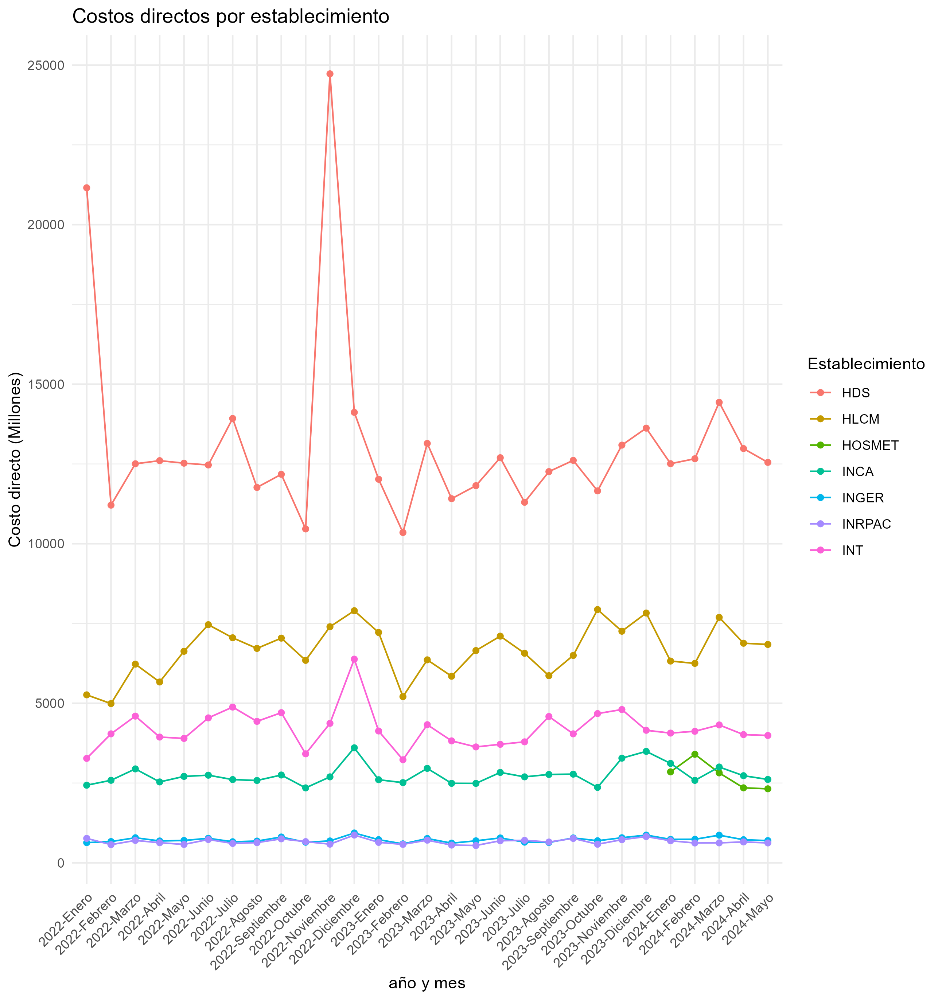

```{r include=FALSE}
library(kableExtra)
library(knitr)
library(here)
library(DT)
library(htmltools)
```


```{r setup, include=FALSE}
if (requireNamespace("thematic")) 
  thematic::thematic_rmd(font = "auto")
knitr::opts_knit$set(root.dir = "C:/Users/alejandro.villegas.SALUDORIENTE/Documents/GitHub/financiamiento_bbdd_postgres/outputs/reports")
knitr::opts_chunk$set(echo = TRUE)
load(here::here("data", "processed", "promedio_por_sigla.RData"))
load(here::here("data", "processed", "info_completa.RData"))
```


## R Markdown

This is an R Markdown document themed with [`{bslib}` package](https://rstudio.github.io/bslib/). `{bslib}` makes it easy to customize the main colors and fonts of a `html_document`, [`flexdashboard::flex_dashboard`](https://flexdashboard-pkg.netlify.app/articles/articles/theme.html), [shiny::fluidPage()](https://shiny.rstudio.com/reference/shiny/latest/fluidPage.html), or more generally any website that uses [Bootstrap](https://getbootstrap.com/) for styling. The `theme` parameter in the yaml front-matter of this Rmd document describes a [`bslib::bs_theme()`](https://rstudio.github.io/bslib/reference/bs_theme.html) object. This particular example uses Bootstrap 3 (`version: 3`), which is primarily for 'legacy' documents that would break with Bootstrap 4 or above.

## Themed Plots {.tabset .tabset-pills}

When running this document with [`{thematic}`](https://rstudio.github.io/thematic/) installed, the `thematic::thematic_rmd(font = "auto")` effectively translates `theme` (CSS) settings to new global theming defaults for `{ggplot2}`, `{lattice}`, and `{base}` R graphics:

### Costos directos

```{r echo=FALSE}

```

```{r echo=FALSE}

HTML("<h2>Costo directo promedio mensual</h2>")

datatable(promedio_por_sigla, options = list(
  columnDefs = list(
    list(targets = 2,  # Asume que "Costo Mensual" es la tercera columna (índice base-0)
         render = JS(
           "function(data, type, row, meta){
              if(type === 'display' || type === 'filter'){
                return parseFloat(data).toLocaleString('de-DE', {
                  minimumFractionDigits: 0,
                  maximumFractionDigits: 0
                });
              } else {
                return data;
              }
            }"
         ))
  ),
  autoWidth = TRUE,
  pageLength = 10,
  searching = FALSE,  # Desactivar la caja de búsqueda para eliminar filtros
  paging = F,      # Opcional: puedes desactivarlo si prefieres no tener paginación
  info = FALSE,       # Opcional: desactivar la información de 'Showing 1 to N of N entries'
  class = 'cell-border stripe hover'
), escape = FALSE)  # Asegúrate de ajustar escape según sea necesario

```


```{r resultados-establecimientos, echo=FALSE, results='asis'}


# Generar texto para cada establecimiento y suprimir el NULL
invisible(apply(info_completa, 1, function(x) {
  cat(paste0("El costo promedio mensual para ", x["Establecimiento"], 
             " es de ", format(as.numeric(x["Costo directo promedio Mensual"]), big.mark = ".", decimal.mark = ",", digits = 2), 
             " unidades monetarias. Este establecimiento ha registrado un gasto máximo de ", 
             format(as.numeric(x["Maximo"]), big.mark = ".", decimal.mark = ",", digits = 2), 
             " y un mínimo de ", format(as.numeric(x["Minimo"]), big.mark = ".", decimal.mark = ",", digits = 2), 
             " unidades monetarias en los períodos reportados.\n\n"))
}))

```


### Costo promedio mensual

```{r echo=FALSE}

datatable(promedio_por_sigla, options = list(
  columnDefs = list(
    list(targets = 2,  # Asume que "Costo Mensual" es la tercera columna (índice base-0)
         render = JS(
           "function(data, type, row, meta){
              if(type === 'display' || type === 'filter'){
                return parseFloat(data).toLocaleString('de-DE', {
                  minimumFractionDigits: 0,
                  maximumFractionDigits: 0
                });
              } else {
                return data;
              }
            }"
         ))
  ),
  autoWidth = TRUE,
  pageLength = 10,
  searching = FALSE,  # Desactivar la caja de búsqueda para eliminar filtros
  paging = F,      # Opcional: puedes desactivarlo si prefieres no tener paginación
  info = FALSE,       # Opcional: desactivar la información de 'Showing 1 to N of N entries'
  class = 'cell-border stripe hover'
), escape = FALSE)  # Asegúrate de ajustar escape según sea necesario

```

### HSO

```{r}
lattice::show.settings()
```

### HLCM

```{r}
plot(pressure, col = thematic::thematic_get_option("accent"))
```


### INT

```{r}
plot(pressure, col = thematic::thematic_get_option("accent"))
```


### INCA

```{r}
plot(pressure, col = thematic::thematic_get_option("accent"))
```


### HLCM

```{r}
plot(pressure, col = thematic::thematic_get_option("accent"))
```


### HLCM

```{r}
plot(pressure, col = thematic::thematic_get_option("accent"))
```


## modificacion {.tabset .tabset-pills}

When running this document with [`{thematic}`](https://rstudio.github.io/thematic/) installed, the `thematic::thematic_rmd(font = "auto")` effectively translates `theme` (CSS) settings to new global theming defaults for `{ggplot2}`, `{lattice}`, and `{base}` R graphics:

### Eficiencia

```{r echo=FALSE}

datatable(promedio_por_sigla, options = list(
  columnDefs = list(
    list(targets = 2,  # Asume que "Costo Mensual" es la tercera columna (índice base-0)
         render = JS(
           "function(data, type, row, meta){
              if(type === 'display' || type === 'filter'){
                return parseFloat(data).toLocaleString('de-DE', {
                  minimumFractionDigits: 0,
                  maximumFractionDigits: 0
                });
              } else {
                return data;
              }
            }"
         ))
  ),
  autoWidth = TRUE,
  pageLength = 10,
  searching = FALSE,  # Desactivar la caja de búsqueda para eliminar filtros
  paging = F,      # Opcional: puedes desactivarlo si prefieres no tener paginación
  info = FALSE,       # Opcional: desactivar la información de 'Showing 1 to N of N entries'
  class = 'cell-border stripe hover'
), escape = FALSE)  # Asegúrate de ajustar escape según sea necesario

```

### lattice

```{r}
lattice::show.settings()
```

### lattice2

```{r}
lattice::show.settings()
```

### base

```{r}
plot(pressure, col = thematic::thematic_get_option("accent"))
```
